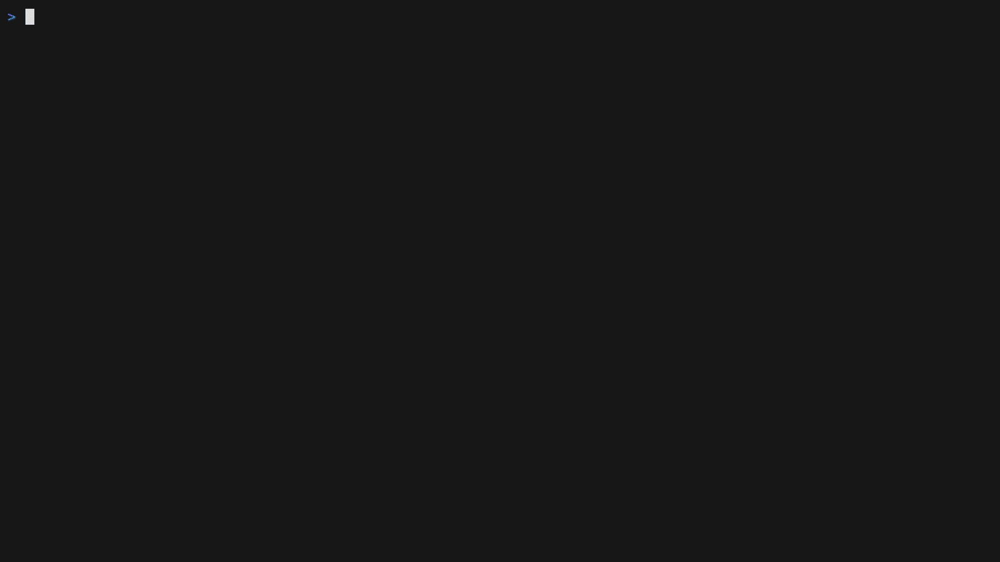
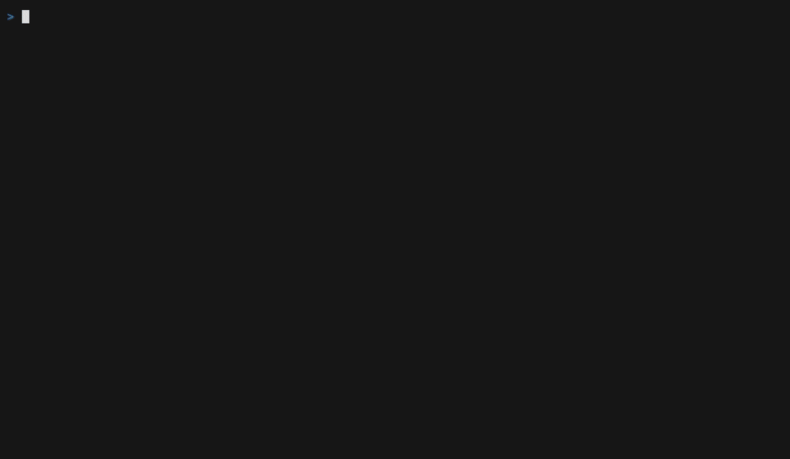

# scorchtop

**btop for AI coding agents.** A live terminal dashboard for your Claude Code
token usage — every project, every model, streaming in real time.



- **Live dashboard** — projects as gradient bars, a dancing per-project
  equalizer, tokens/min sparkline, burn rate, and a turns panel showing what
  each prompt cost. Reacts within ~1s of Claude Code streaming in another pane.
- **`scorchtop wrapped`** — a monthly shareable scorecard: GitHub-style daily
  heatmap, top projects, biggest session, busiest day.
- **Zero interference** — `~/.claude/` is strictly read-only. Event-driven
  file watching (no polling), near-zero CPU when idle, no network calls.

## Install

```sh
curl --proto '=https' --tlsv1.2 -LsSf https://github.com/raqlaylabs/scorchtop/releases/latest/download/scorchtop-installer.sh | sh
```

or with npm:

```sh
npx scorchtop
```

or from source:

```sh
cargo install --git https://github.com/raqlaylabs/scorchtop
```

Prebuilt binaries: macOS (Apple Silicon + Intel) and Linux x64.

## Usage

```sh
scorchtop             # live dashboard
scorchtop wrapped     # monthly scorecard
scorchtop dump --json # aggregate totals, machine-readable
```

Press `?` in any screen for the keybind cheat-sheet.

### Dashboard keys

| key | action |
| --- | ------ |
| `d` / `w` / `m` | today / last 7 days / last 30 days |
| `x` | color bars by model instead of rank |
| `t` | turns panel (prompt → tokens → lines written) |
| `?` | help |
| `q` | quit |

## Wrapped



A monthly summary built for sharing: total tokens, est. API value, active
days, top projects, biggest session, and a per-day heatmap.

| key | action |
| --- | ------ |
| `◂` `▸` | previous / next month |
| `b` | blur project names |
| `r` | record the entrance animation as a GIF |
| `?` | help |
| `q` | quit |

### Safe to share: blur mode

Client names and employer repos don't belong in screenshots. Press `b` (or
launch with `scorchtop wrapped --blur`) and every project name is replaced
with a stable pseudonym — `project-a` is the month's top project, then
`project-b`, and so on — so the ranking stays readable while the names stay
private. The biggest-session highlight blurs through the same mapping. Blur
also applies to GIFs recorded with `r`.

### One-keypress GIF

Press `r` and scorchtop renders the entrance animation to a high-resolution
GIF (`scorchtop-wrapped-<month>.gif` in your working directory) — no screen
capture, no external tools, works over SSH.

## Notes

- Dollar figures are **estimated API value** at public per-token rates — what
  the usage would cost via the API, not what your subscription charges.
- Data source: `~/.claude/projects/**/*.jsonl`, deduplicated by message and
  request id. Daily aggregates persist in `~/.local/share/scorchtop/` so
  history survives transcript pruning.
- Currently supports Claude Code; the source layer is a trait, adapters for
  other agents welcome.

## Future scope

Ideas on the table (PRs welcome):

- [ ] **Codex adapter** — surface OpenAI Codex / `gpt-*` usage through the same `Source` trait.
- [ ] **Gemini adapter** — same for Gemini CLI transcripts.
- [ ] **Global dashboard** — aggregate usage across a whole team of devs into one shared view (opt-in, self-hosted).
- [ ] **Budget & alerts** — configurable daily/monthly thresholds with an in-TUI warning when you're burning past them.
- [ ] **Custom pricing config** — override the hardcoded rate table for negotiated/enterprise pricing.
- [ ] **Session drill-down** — expand a project into its individual sessions, with per-session cost and duration.
- [ ] **History export** — dump daily aggregates to CSV/JSON for spreadsheets or dashboards.
- [ ] **Homebrew formula** — `brew install scorchtop` alongside the curl and npm installers.
- [ ] **Themes** — a few built-in color palettes beyond the default.

## License

MIT. Bundled JetBrains Mono font is under the [OFL](assets/fonts/OFL.txt).
